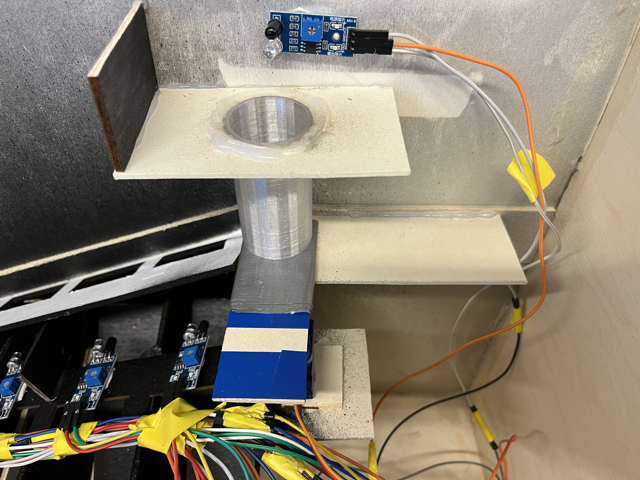

# Le capteur principal

 Le capteur principal est le premier capteur de notre tirelire. C'est lui qui va indiquer au moteur de tourner pour faire tomber les pièces sur la
    glissière 

    

 Il se situe juste au dessus du tube d'empilement, là où les pièces rentre dans la tirelire 

 Une fois rentrées, les pièces sont détectées une par une par ce capteur qui va dire au moteur de tourner afin de pousser la pièce en question sur la
  glissière 

  

