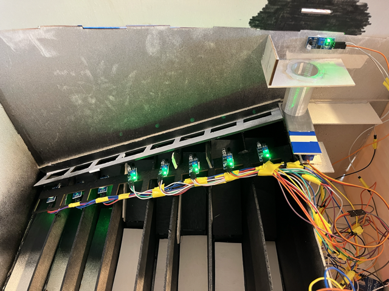

# Les capteurs des pièces

 Les capteurs des pièces sont tous situés sous la glissière au niveau de chaque trou à pièces. Il y a en tout 8 capteurs, autant qu'il y a de pièces
    différentes. Un capteur correspond à une pièce spécifique. 

    

 Lorsqu'une pièce tombe devant un capteur, la valeur de la pièce est rajoutée au compteur. Pour une pièce de 20 centimes, on rajoute 0,20 au compteur
    et pour une pièce de 1 euro on rajoute 1. 

 Toute paroi entourant les capteurs sont en noir afin qu'ils ne captent uniquement les pièces et rien d'autre 

