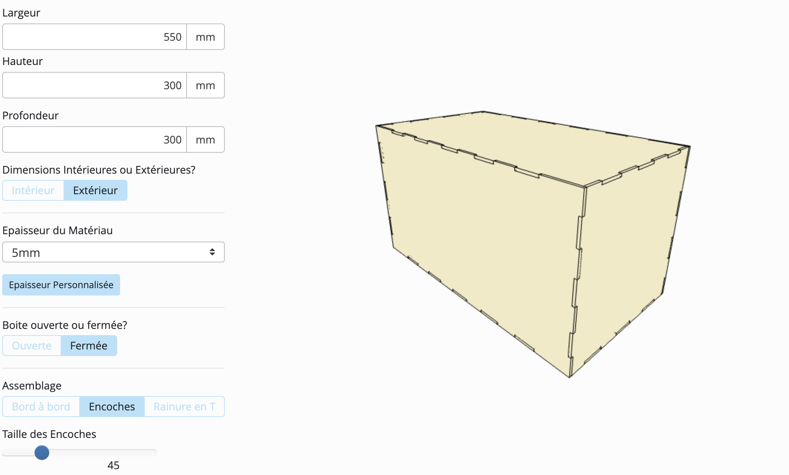

## -- Coffrage de la Tirelire -- ##

# Utilisation de Makercase, site permettant de modéliser des boites et de télécharger les plans de découpe au format svg. #

 Plan 3D de la boite ici (lien vers le site) ou sur l'image ci-dessous 

 Plan de découpe de la boite ci-dessous avec les quatres faces de la boite. 

 Le découpage du bois se fait dans le Fablad avec une machine de découpage laser et avec l'aide du logiciel Inkscape 

