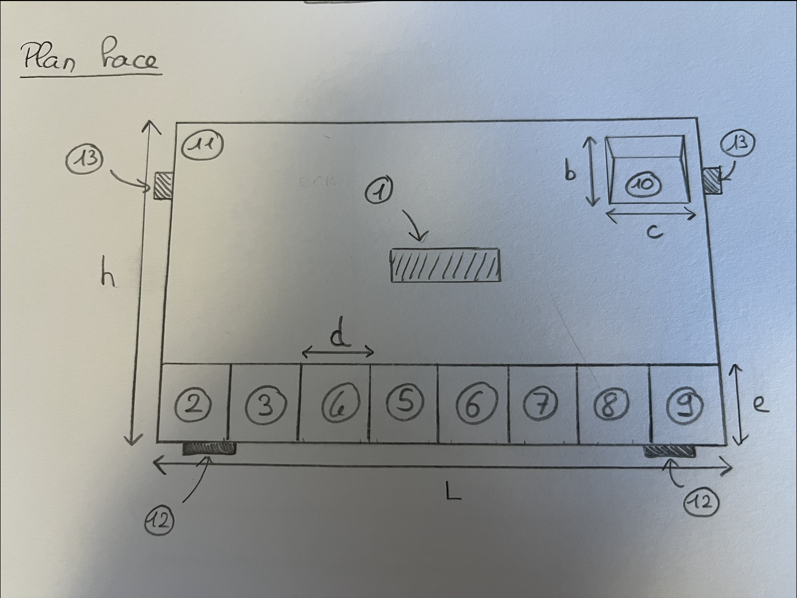

# Schéma tirelire Intelligente #

 La tirelire est composé : d'un coffrage principal en bois, avec un trou pour mettre les pièces et des tiroirs pour les récupérer. Sur le plan de face,
un ecran LCD affiche la monnaie 

## Plan face ##

<ol>
  <li> Ecran LCD </li>
  <li> Tiroir pièces de 2 euros </li>
  <li> Tiroir pièces de 1 euros </li>
  <li> Tiroir pièces de 50 centimes </li>
  <li> Tiroir pièces de 20 centimes </li>
  <li> Tiroir pièces de 10 centimes </li>
  <li> Tiroir pièces de 5 centimes </li>
  <li> Tiroir pièces de 2 centimes </li>
  <li> Tiroir pièces de 1 centimes </li>
  <li> Ouverture permettant de jeter les pièces dans la tirelire </li>
  <li> Coffret principal en bois </li>
  <li> Patins en mousse permettant de sur-élever légérement la tirelire et d'assurer le bon fonctionnement des tiroirs </li>
</ol>
<ul>
  <li> h : hauteur du coffret : 30 cm </li>
  <li> L : Longueur du coffret : 40 cm </li>
  <li> b : hauteur ouverture à pièces : 8 cm </li>
  <li> c : longueur ouverture à pièces : 10 cm </li>
  <li> d : hauteur tiroirs : 6 cm </li>
  <li> e : longueur tiroirs : 5 cm </li>
</ul>

## Plan Droite ##

## Plan Gauche ##

## Plan Arrière ##

## Plan Haut ##

## Plan Bas ##
