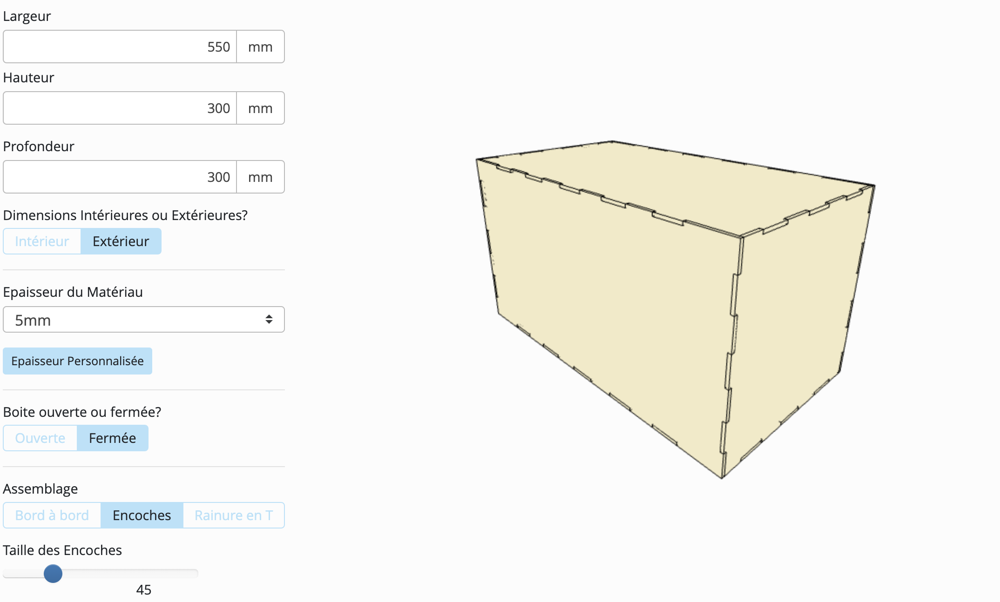
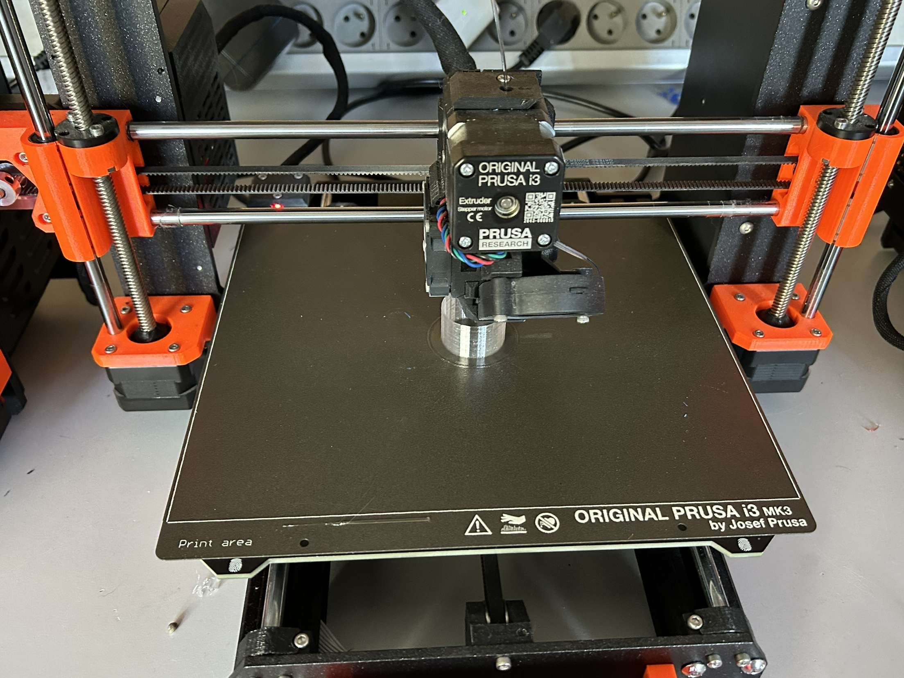
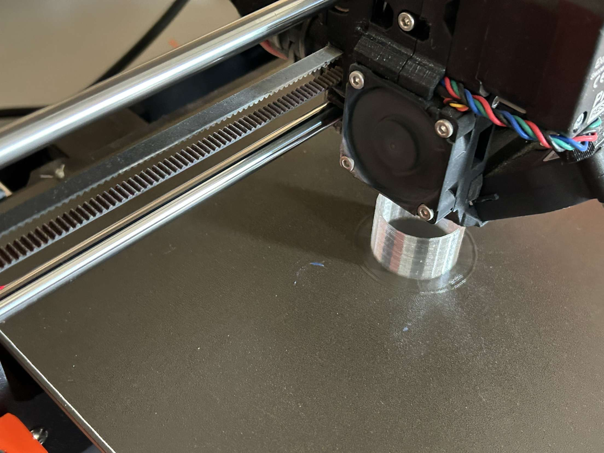

# Tube pour les pièce

## Fonctionnement ##

Le tube pour les pièce se situe juste en dessous de l'entrée à pièce et juste au dessus de la glissière. Après avoir mis une pièce dans la tirelire,
la pièce vient se placer sur la pile de pièce dans le tube. Celui à pour fonction de ranger les pièces correctement en pile avant le tri.

<ul> Dimensions : 
  <li> Diamètre extérieur : 31mm </li>
  <li> Diamètre intérieur : 29mm </li>
  <li> épaisseur : 2mm </li>
  <li> Hauteur : 60mm </li>
</ul>

## Modélisation 3D sur sketchup ##

## Impression 3D ##

## Rendu Final du tube ##

