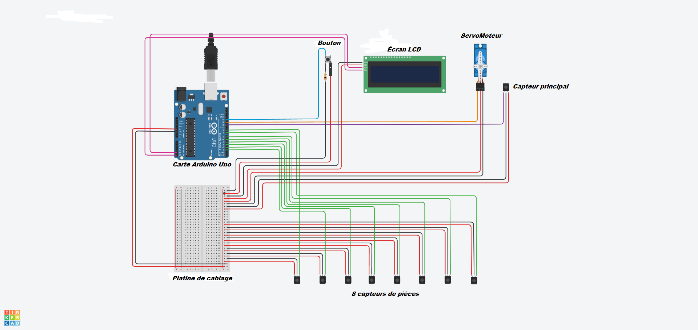

# Rapport de Projet - SmartPiggyBank - La tirelire intelligente #

 Benjamin Guillaumat - Ralph Mansour 

—------------------------------------------------------------------------
1) Il doit faire au grand maximum 10 pages (donc 5 feuilles) tout compris, mais 5 pages devraient suffire. Il devra être mis sur votre Github au plus tard à 22h une semaine après votre oral (-1pt/10 par minute de retard)

2) Le rapport final est une synthèse de votre projet, il doit pouvoir servir de notice d’utilisation. DONC : ce n'est pas un copié/collé des rapports de séance.

—------------------------------------------------------------------------

## 1 - introduction : objectif (cahier des charges): ## // Benji

## 2 - Schéma électrique du projet. ## // Benji

## 3 - Algorithme de fonctionnement : on doit pouvoir comprendre le fonctionnement global du projet ## //Ralph

## 4 - Le coût du projet : matériel (estimation en utilisant amazon par exemple) + coût ingénieur en partant (pour faire simple) d’un salaire brut annuel de 38 keuros pour 1600h de travail. Il faudra estimer le temps que vous avez passé en cours + en dehors des cours. ## //Ralph

## 5 - Les plannings (initial et final) et commenter les différences ## //Benji

## 6 -  S’il y a eu des problèmes dire comment vous les avez surmonté ## // Benji

## 7 - Conclusion-perspective : il faudra rappeler ce qui a été fait, ce qui marche, ce qui ne marche pas et qu’est-ce qu’il faudrait faire par la suite si je vous donne encore 9 séances ## //Ralph

## 8 - Bibliographie : mettre les liens des sites qui vous ont aidé à développer votre projet ##

