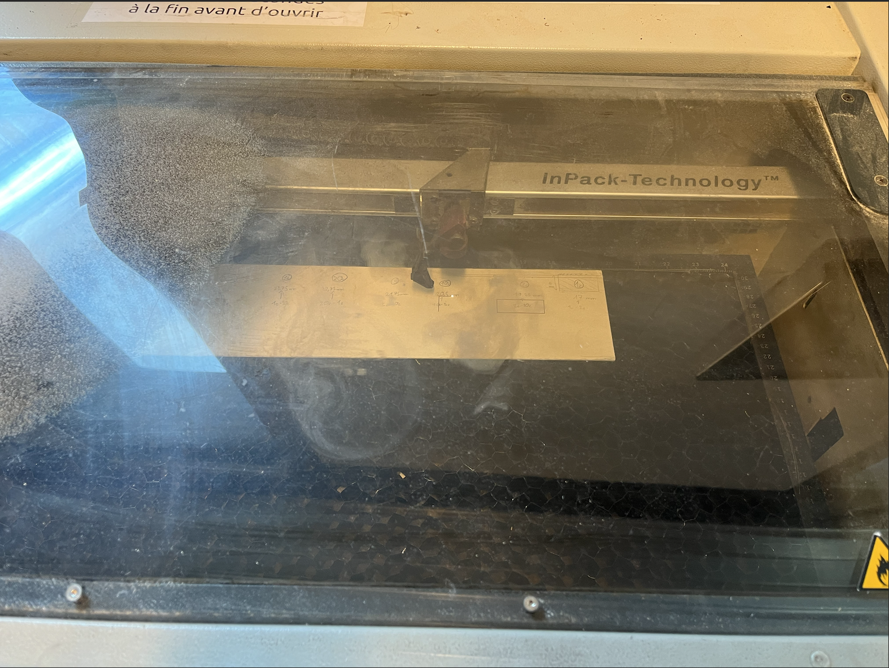

# -- Rapport de séance Benjamin Guillaumat - Séance 3 -- #

## 1 :

J'ai fait découper avec le découpage laser la glissière pour les pièces. Une première version sur un bois spécial, fin et glissant mais la glissière est très fragile. J'ai donc aussi fait découper une seconde version sur un bois de 3mm plus rigide. Il est cependant bien moins glissant voir non glissant pour les pièces. J'ai donc récupérer une couche autocolante gloissante (car bien lisse) que je collerai sur ma glissière afin que les pièces glisse facilement.

## 2 :

Découpage laser pour le coffrage de la tirelire (voir photo). Au début, j'ai fait mes plan pour une découpe de ce coffrage sur un bois de 5mm. Mais la découpe laser est bien plus longue et le résultat est bien moins précis et propre que sur une plache de 3mm. J'ai donc refais mes plans afin de découper les 6 faces du coffrage sur un bois de 3mm.

## 3 :

Le coffrage (modélisé avec Makercase) est fait de sorte que l'on puisse emboiter les 6 faces possédant des encoches (voir photo screen). L'objectif pour nous, est que nous ayons un coffrage fermé pour continuer notre projet mais tout en ayant accès facilement à l'intérieur de la boite. C'est pourquoi j'ai commencé à coller avec de la colle à bois les faces du bas, des cotés et de derrière entre elles :

INSERER PHOTO 

Ces faces là peuvent être collées des à présent puisque aucune modification (découpe) ne sera faite sur celles-ci. 
Alors que la face de devant et de dessus auront besoin de découpe par la suite, d'oùù le fait qu'on ne les colle pas maintenant.

