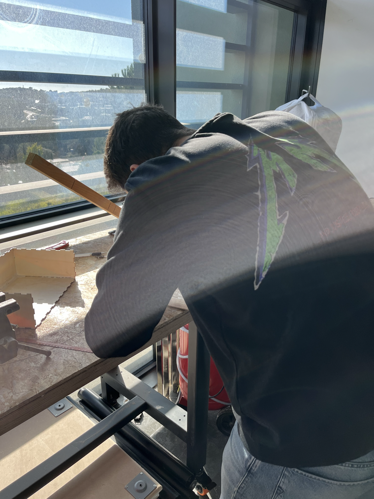
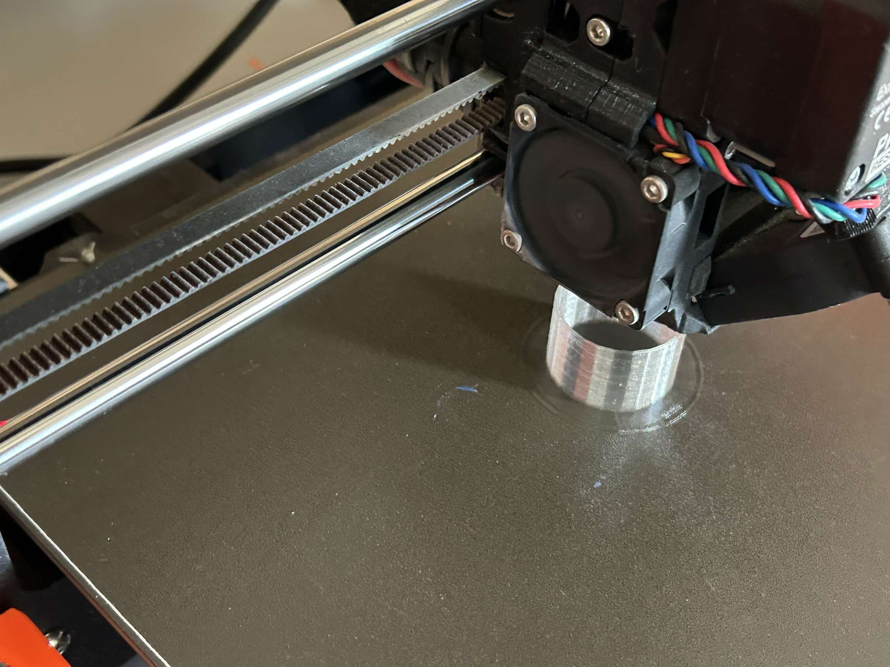

# -- Rapport de séance Benjamin Guillaumat - Séance 4 -- #

## 1 : Changer la matière de la glissière.

Après avoir découpé notre glissière sur une plache de 3mm, j'ai remarqué que la pièce ne glissait pas assez sur la planche. On a donc rajouté une suface glissante autocollante afin qu'il n'y ai plus de problème d'accrochage. Voici la glissière à pièce terminé :

## 2 : Découper les cloisons qui délimitent chaque tiroirs à pièce.

Une fois les pièces tombées de la glissière, elles tomberont dans leurs tiroirs respectifs. Ralph à donc pris les mesures et j'ai découpé chaque planches qui serviront de séparation. 

## 3 : Impression 3D 

Une fois les pièces mise dans la tirelire, elle se rangeront dans un premier tempsn dans un tube, dans lequel elles seront en pile.
Afin d'avoir un tube sur mesure, j'ai schématisé sur un logiciel de modélisation 3D (Sketchup) le tube.

## 4 :

J'ai commencé à répertorier la matière première que l'on aura besoin et les matériaux (voir <a href="../../Développement/Matériaux.md"> Matériaux nécessaires</a>). 
