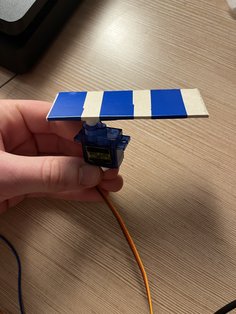

# -- Rapport de séance Benjamin Guillaumat - Séance 6 -- #

## 1 : Collage de la glissière au coffrage

Après avoir choisi l'angle idéal pour que les pièces tombent à une bonne vitesse, avoir tracé au crayon de papier mes repère sur le coffrage et ajouter une paroi butoire sur la glissière, j'ai collé celle-ci sur le coffrage. Je l'ai fixé à l'aide d'un scotch double face afin que l'on puisse la retirer en cas de problème tout en ayant une bonne solidité pour supporter le poids des pièces.
J'ai ensuite testé la glissère en vérifiant que chaque pièces tombait dans le bon trou selon sa valeur en faisant plusieurs tests. J'ai eu un seul souci avec la pièce de 1 euro qui ne tombait pas dans son trou mais dans celui d'après. J'ai résolu ce problème en agrandissant très légérement le trou en gratant le bois sur le côté (la taille du trou étant au dixième de millimètre près, il fallait résoudre le problème avec beaucoup de précision).

## 2 : Finissions du moteur + code moteur

L'aile du moteur étant trop courte, j'ai ralongé celle-ci avec du bois fin. La longueur est faites de sorte à ce que la ralonge pousse suffisament loin les pièces qui vont ensuite tomber sur la glissière. L'intervale des angles sur lequel le moteur fait ses rotation est le suivant : [0,100].
Il permet à la ralonge de parcourir une assez grand angle pour qu'une fois une pièce poussée, une autre puisse tomber et se positionner prète à être poussé à son tour.

## 3 : Calibrage écran et affichage de texte puis du compte de la monnaie (code)

J'ai branché l'écran et j'ai passé du temps à afficher du texte. Le problème était que l'écran avait un contraste trop élevé. J'ai du le paramètrer à l'aide du petit module bleu sur la controlleur soudé à l'écran. Une fois le texte affiché, j'ai simplement affiché la variable "tot" qui représente notre valeur de pièce mise dans la tirelire.

## 4 : Finnission du code complet et test

J'ai terminé le code complet qui comporte donc :
  - Une partie code moteur   -----               <a href="../../Développement/Codes/Code moteur.md"> Voir le code entier avec tous les détails </a>
  - Une partie code écran   -----               <a href="../../Développement/Codes/Code écran.md"> Voir le code entier avec tous les détails </a>
  - Une partie code capteurs des pièces   -----   <a href="../../Développement/Codes/Capteurs pour pièces.md"> Voir le code entier avec tous les détails </a>
  - Une partie code bouton   -----         <a href="../../Développement/Codes/Code bouton.md"> Voir le code entier avec tous les détails </a>

Cliquer sur les liens pour voir toutes les explications et les détails des codes.

Une fois tout les branchements fait, j'ai testé le fonctionnement global et les intéractions entre capteurs+moteurs / capteurs+compteur / compteur+écran / bouton+compteur.
Lorsque qu'une pièce passe devant un capteur, le compteur est bien incrémenté de la valeur de la pièce en question. Lorsque qu'une pièce passe devant un capteur, l'écran affiche en temps réel le montant de la tirelire qui évolue. Lorsqu'une pièce passe devant le capteur à l'entrée de la tirelire, le moteur et déclenché et viendra pousser la pièce en question dans la glissière. Lorsque que l'on appuie sur le bouton, le compteur est réinitialisé à 0.00€ et l'écran prend bien en compte la réinitialisation et affiche en conséquence 0.00 euro.

## 5 : Pour la prochaine séance....

Durant la prochaine séance, l'objectif et de se concentré sur la finissions du montage de la tirelire avec l'installation du moteur, du l'écran, du bouton et tout les branchement et l'organisation éléctronique qui en découle.

