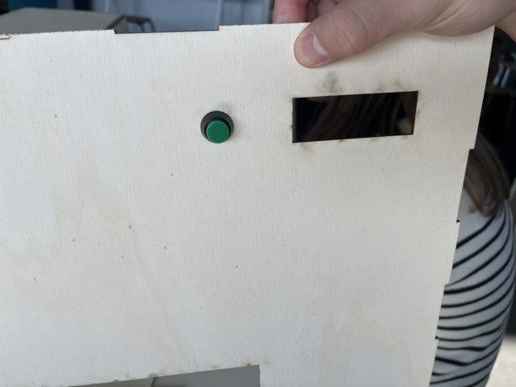
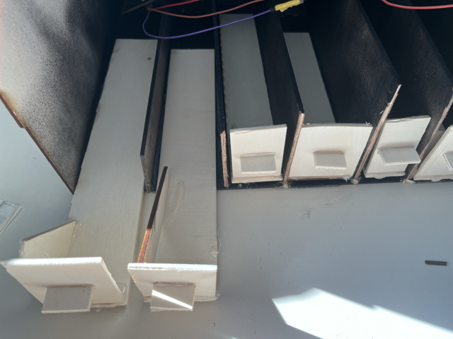
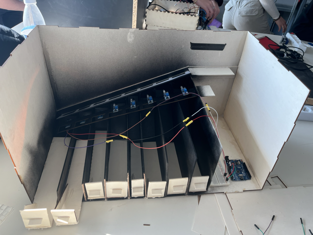

# -- Rapport de séance Benjamin Guillaumat - Séance 7 -- #

## 1 : Ajout du trou pour l'écran ##

 Le code étant terminé, nous devons maintenant installer le matériel. Pour cela je me suis chargé de découper à la découpeuse laser le trou permettant d'accueillir l'écran d'affichage. 

  

  ## 2 : Création des tiroirs de récupération + ajout de glissière supplémentaire ##
  

 Il y a quelques séances, nous avions rajouter les cloisons en bois séparant les différentes pièces une fois triées. Nous voulons rajouter un système de récupération des pièces à notre tirelire. Pour cela je me suis chargé de créer les diffférents tiroirs dans lesquelles les pièces tomberons et grâce auxquelles nous pourrons les récupérer. 

 J'ai aussi rajouté des "glissières" ou "pentes" placées juste en dessous de la glissière afin que les pièces tombent bien dans les tiroirs correspondants. 

    
 ## 3 : Peinture noir sous la glissières ##
 
 
 Avant la mise en place des 8 capteurs pour les 8 pièces, je me suis chargé de peindre en noir les espaces vus pas les capteurs. Durant la conception, nous avons rencontré un problème avec les capteurs. Quand nous les mettions à leurs emplacements, c'est à dire en dessous de la glissière, ils captaient en permanences quelque chose. Ce quelque chose était les cloisons et le coffrage de la tirelire, qui étant de couleur vive, réfléchissait la lumière et activer les capteurs. Pour remedier à ce problème, j'ai donc peint en noir toute cette partie. Après de nouveaux essais, les capteurs sont maintenant en mesure de capter uniquement les pièces qui tombent et nous les cloisons alentours 

 
 
 
  ## 4 : Mise en place des supports pour le moteur et le tube d'empilement des pièces ##
  
  
 Durant cette séance, j'ai aussi mis en place les accroches, les supports pour installer le moteur et le tube d'empilement des pièces. 

  
  
  
  
  
  PS : Je n'ai pas eu le temps de prendre les photos durant la séance dans la précipitation. Je les mettrai le 15/02 dans 2 jours.
