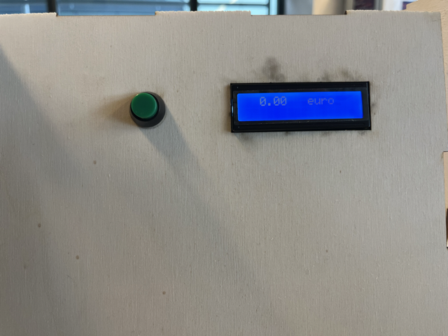

# -- Rapport de séance Benjamin Guillaumat - Séance 8 -- #

## 1 : Installation de l'écran et du bouton ##

 Après avoir découpé les emplacements pour l'écran et le bouton dans le coffrage, j'ai installé, fixé les deux élément à la tirelire 

  

  ## 2 : installation et branchements des capteurs ##
  
  
   

