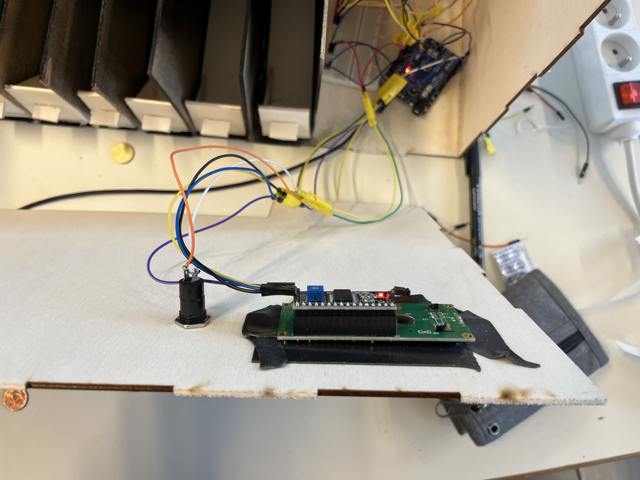

# -- Rapport de séance Benjamin Guillaumat - Séance 8 -- #

## 1 : Installation de l'écran et du bouton ##

 Après avoir découpé les emplacements pour l'écran et le bouton dans le coffrage, j'ai installé, fixé les deux élément à la tirelire 

  

## 2 : installation et cablage des capteurs ##
  

 Une fois la glissère installer et les parois peintent en noir, j'ai installer et brancher tous les capteurs de pièces. Les cables sont tous en ligne derrières les capteurs et rejoignent tous la base de branchement et la carte arduino à droite de la tirelire. J'ai fixé les capteurs avec de la pate à fixe afin qu'ils soient facilement magnables pour faire les réglages.

  

## 3 : Cablages bouton + écran ##

 Une fois installé j'ai cablé l'écran et le bouton à la carte arduino 

## 4 : Réglages capteurs ##

 Une fois branché, nous avons testé les capteurs un par un avec Ralph pour les recaler et faire les réglages d'intensité des capteurs. Ralph s'occupait de vérifier le bon déclenchement des capteurs et si les bonnes valeurs s'affichaient sur l'écran. Pendant que moi je bouger et réglé les capteurs pour que tout fonctionne bien. 

