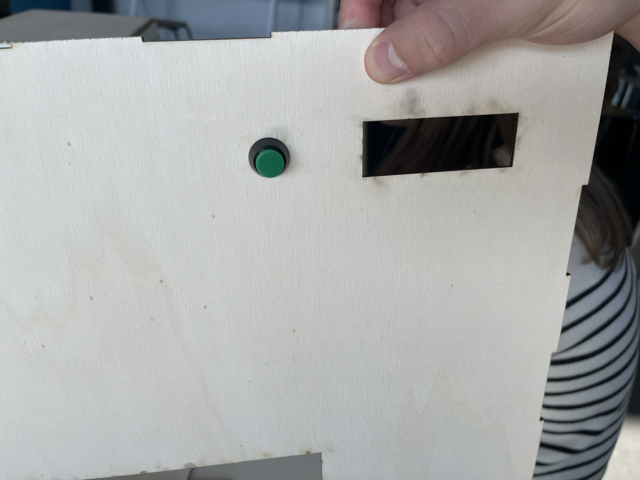

# -- Rapport de séance Benjamin Guillaumat - Séance 7 -- #

## 1 : Ajout du trou pour l'écran ##

 Le code étant terminé, nous devons maintenant installer le matériel. Pour cela je me suis chargé de découper à la découpeuse laser le trou permettant d'accueillir l'écran d'affichage. 

  

  ## 2 : Création des tiroirs de récupération + ajout de glissière supplémentaire ##
