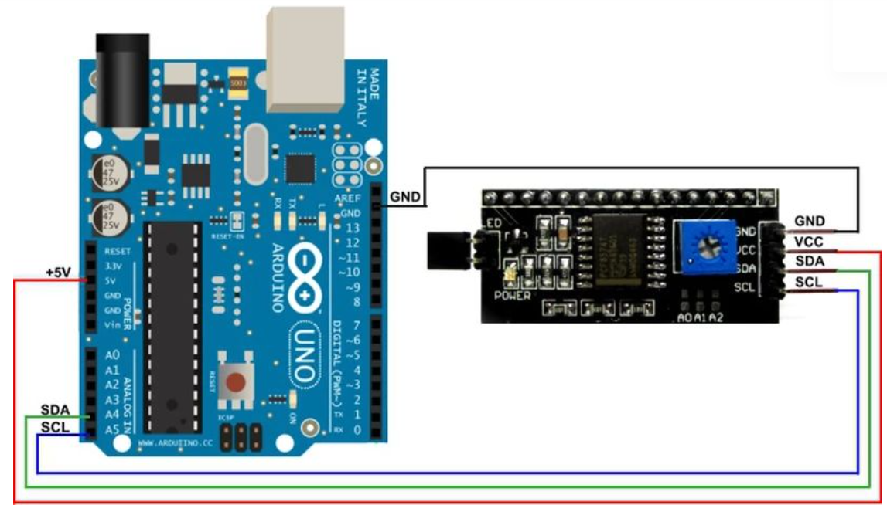

<h1>Ralph - Rapport Séance 3</h1>	

 Lors de cette séance, j'ai commencé par aider Benjamin à couper le bois (pour notre boite).

 Nous avons choisis le bois de 3mm d'epaisseur pour qu'elle soit plus légère et pour qu'on puisse enlever facilement la face avant et dessus pour mettre nos composants (le cablage etc...).

 - 

 Ensuite, Benjamin est allé imprimer et couper la boite. Je me suis interressé au code. Surtout aux capteurs. 

<h3> Le fonctionnement de notre code: </h3>

   

 Enfin, j'ai fait des recherches sur Internet pour comprendre le fonctionnement d'un écran LCD et comment le coder en utilisant le site https://www.tutoriel-arduino.com/lcd_i2c_arduino/. 

 Voici le cablage de l'ecran LCD 

