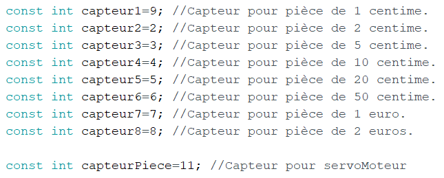
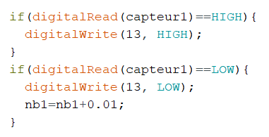

<h1>Ralph - Rapport Séance 3</h1>	

 Lors de cette séance, j'ai commencé par aider Benjamin à couper le bois (pour notre boite).

 Nous avons choisis le bois de 3mm d'epaisseur pour qu'elle soit plus légère et pour qu'on puisse enlever facilement la face avant et dessus pour mettre nos composants (le cablage etc...).

 - 

 Ensuite, Benjamin est allé imprimer et couper la boite. Je me suis interressé au code. Surtout aux capteurs. 

<h3> Le fonctionnement de notre code: </h3>

Ici, nous avonc initialisé chaque capteur a sa propre entrée, puisque par la suite nous allons ajouté la sortie de chaque capteur à un compteur final, qui sera le compteur qui va s'afficher sur l'ecran LCD.

 J'ai fait ceci pour chacun des capteurs. En effet, le capteur a une distance maximale d'environ 40cm (j'ai testé) donc dans la boite nous avons fait exprès de mettre la face d'avant à plus de 40cm de chacun des capteurs pour les pièces. Ensuite, quand la pièce tombe devant le capteur en question, on ajoute aux compteurs individuels la somme de cette pièce./p>

Par exemple, une pièce de 10 centimes tombe devant son capteur. Dans le code, nous ajoutons 0.1 à nb4, qui est le compteur de la pièce de 10 centimes (0.1 euros). 

 A la fin du code nous ajoutons tous les nbi des pièces différentes au compteur final nb, pour qu'on puisse afficher nb  sur l'ecran. 

 PS: je n'arrive pas à charger les photos dans notre répertoire Images. Je les ajouterai une prochaine fois 

