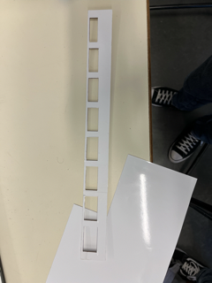

<h1>Ralph - Rapport Séance 4</h1>	

<h3>Séance découpage - Séance bois </h3>

 J'ai commencé la séance par optimisant la glissière. En effet, lors de la séance précédante, nous avons remarqué que le bois que nous avons choisi ne laisse pas les pièces glisser.

 Pour les faire glisser, nous avons coller un auto-collant sur notre glissière:

 Ensuite, j'ai pris les mesures pour les murs (à l'intérieur de la boite).

 Les murs ont une hauteur de 4,5cm jusqu'à 13,5 cm puisque notre glissière est placée contre la face de fond et a un angle d'environ 25-30 degrés. Donc le trou de la pièce 2 euros est située à une hauteur de 4,5cm.
 

 Benjamin a coupé le bois pour les murs 

 - 

 Ensuite, j'ai coupé la "deuxième glissière": celle en dessous de la glissière principale.

 Sur celle-ci, on va poser (coller) les capteurs dirigés vers le trou de la principale pour voir les pièces tomber:

 

 - 

 Ensuite, Benjamin est allé imprimer et couper la boite. Je me suis interressé au code. Surtout aux capteurs. 

<h3> Le fonctionnement de notre code: </h3>

Ici, nous avonc initialisé chaque capteur a sa propre entrée, puisque par la suite nous allons ajouté la sortie de chaque capteur à un compteur final, qui sera le compteur qui va s'afficher sur l'ecran LCD.

