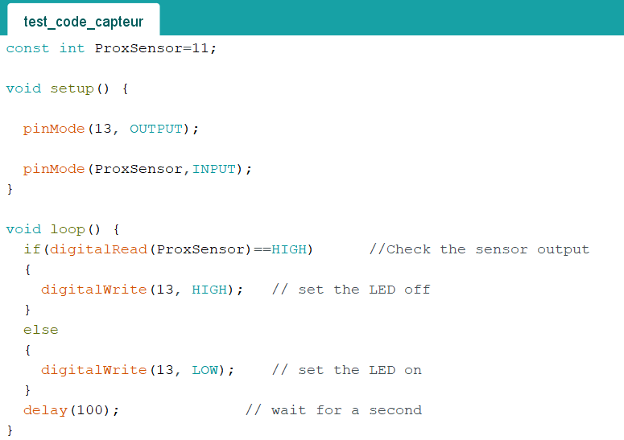

<h1>Ralph - Rapport Séance 5</h1>	

<h3>Séance code + test des capteurs/boutons/écran </h3>

 Au début de la séance, nous avons branché un capteur et testé un code simple: s'il y a un objet devant le capteur, les LEDs du capteurs s'allument.

Voici le code que nous avons utilisé:

Nous avons remarqué que la plupart de nos capteurs ne marchaient pas... nous avons demandé à M. Masson et en fait ils marchaient, on devait juste séprarer légèrement les deux LEDs au bout du capteur (blanc et noir).

-----------------------------

Ensuite, nous avons amélioré (même presque fini) le code principal.

 Quand une pièce tombe dans le trou correspondant de la glissière, un capteur (différent pour chaque pièce), situé sous la glissière, voit si une pièce tombe devant lui.

<a href="../../Développement/Codes/Capteurs pour pièces.md"> Voir le code entier avec tous les détails </a>.

Cela nous a pris quasiment toute la séance (2h) pour tout tester, implementer le bouton, l'ecran, etc...

-----------------------------

Le bouton sert de réinitialiser complètement la tirelire. Une fois le bouton appuyé, le compteur revient à 0:

-----------------------------

Enfin, dans les 10minutes qui me restaient, j'ai essayé de faire marché l'ecran LCD. Or, je n'ai pas vraiment arrivé... Le message s'affiche pendant quelques secondes et s'éteignait. Peut être c'est un problême de cablage, ou j'ai mal soudé, je ne sais pas...

 Voici le code: 

