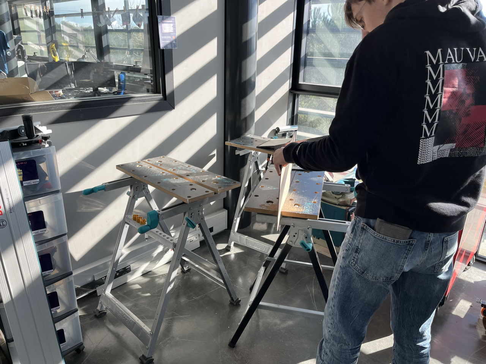
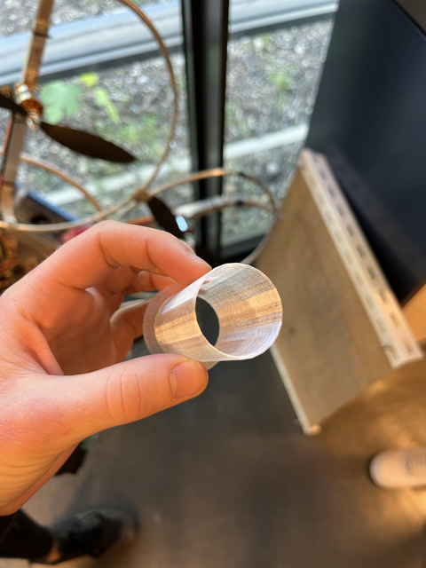

<h1>Ralph - Rapport Séance 5</h1>	

<h3>Séance code + test des capteurs/boutons/écran </h3>

 Au début de la séance, nous avons branché un capteur et testé un code simple: s'il y a un objet devant le capteur, les LEDs du capteurs s'allument.

Voici le code que nous avons utilisé:

 Ensuite, j'ai pris les mesures pour les murs (à l'intérieur de la boite).

 Les murs ont une hauteur de 4,5cm jusqu'à 13,5 cm puisque notre glissière est placée contre la face de fond et a un angle d'environ 25-30 degrés.
 

 Benjamin a coupé le bois pour les murs 

 - 

 Ensuite, j'ai coupé une plaque de bois: celle en dessous de la glissière.

 Sur celle-ci, on va poser (coller) les capteurs dirigés vers les trous de la glissière pour voir les pièces tomber:

 Par la suite, nous avons modélisé le tube (celui qui rassemble toutes les pièces en pile, après insertion) et imprimé en 3D. 

<h3>Code Servo-Moteur et Capteurs</h3>

Enfin, j'ai fait le code pour le servomoteur adapté à notre cas, il suffit de connecter les capteurs au moteur.

On veut que le capteur voit quand une pièce tombe dans la pile quand on l'insère. Une fois la pièce est en bas de la pile, le servomoteur va fair un tour de 180 degrés pour pousser la pièce vers la glissière.

Voici le code du moteur: 

 En utilisant le code de la semaine dernière (tous les capteurs sont associés à une pièce différente, je pourrai faire la liaison entre capteur/moteur. Il reste à faire le code de l'écran et l'intégrer au code.

<a href="../../Développement/Codes/Capteurs pour pièces.md"> Voir le code entier avec tous les détails </a>.
