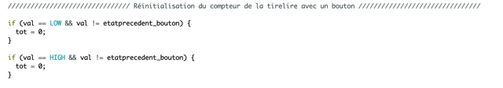

<h1>Ralph - Rapport Séance 6</h1>	

<h4>Murs intérieurs</h4>

 Au début de la séance, j'ai coupé les murs intérieurs pour que leur longueur ne soit pas supérieure à celle de la boite.

 Par la suite je les ai collé: 

-----------------------------

Ensuite, nous avons finis les codes (nous nous sommes focalisés sur l'ecran).

 Voici le code: <a href="../../Développement/Codes/Code ecran.md"> Cliquer ici </a> 

 Quand une pièce tombe dans le trou correspondant de la glissière, un capteur (différent pour chaque pièce), situé sous la glissière, voit si une pièce tombe devant lui.

<a href="../../Développement/Codes/Capteurs pour pièces.md"> Voir le code entier avec tous les détails </a>.

Cela nous a pris quasiment toute la séance (2h) pour tout tester, implementer le bouton, l'ecran, etc...

-----------------------------

Le bouton sert de réinitialiser complètement la tirelire. Une fois le bouton appuyé, le compteur revient à 0:

-----------------------------

Enfin, dans les 10minutes qui me restaient, j'ai essayé de faire marché l'ecran LCD. Or, je n'ai pas vraiment arrivé... Le message s'affiche pendant quelques secondes et s'éteignait. Peut être c'est un problême de cablage, ou j'ai mal soudé, je ne sais pas...

 Voici le code: 

