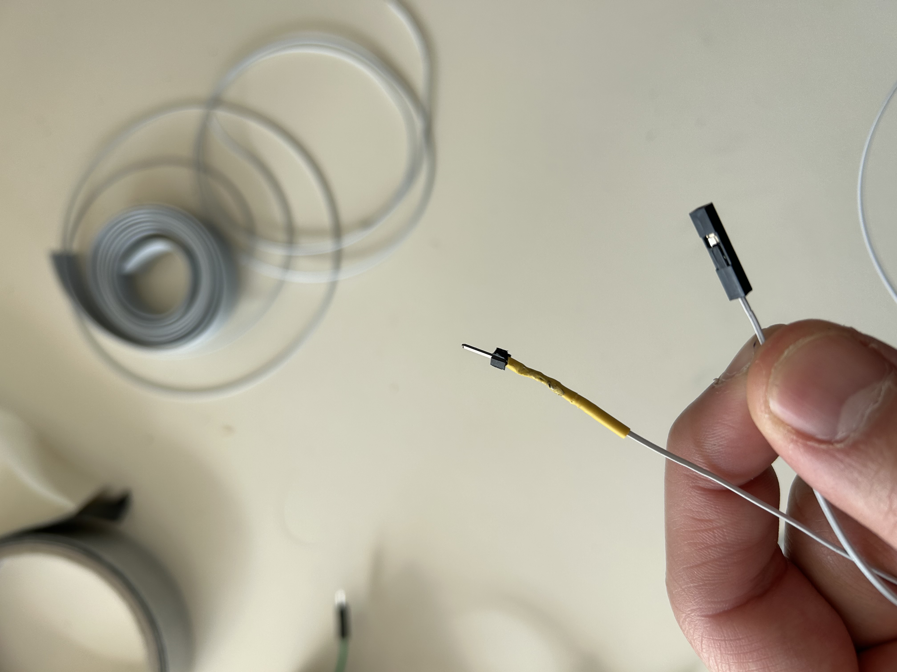

<h1>Ralph - Rapport Séance 7</h1>	

<h4>Séance cables + branchement</h4>

 Au début de la séance, j'ai pris tous les cables que j'avais pour les transformer en cables femelle-femelle ou male-femelle. 

 Voici tous les cables que j'avais avant:

 Et voici en quoi je les ai transformé:

Cela m'a pris environ 1h à faire parce que nous avons besoin d'environ 34 cables pour notre tirelire (et parce que j'ai des gros doigts) 

-----------------------------

Ensuite, nous avons fixé la glissière pour les capteurs : elle est en parallèle et légèrement en dessous de la glissière principale.

On a collé les capteurs sur celle-ci avec un trou derrière pour notre "cable management". Tous les fils vont passer dans les trous et on va les coller. 

Nous avons uniquement branché un capteur. Nous allons tout brancher avant de les "scotcher" ensemble.

