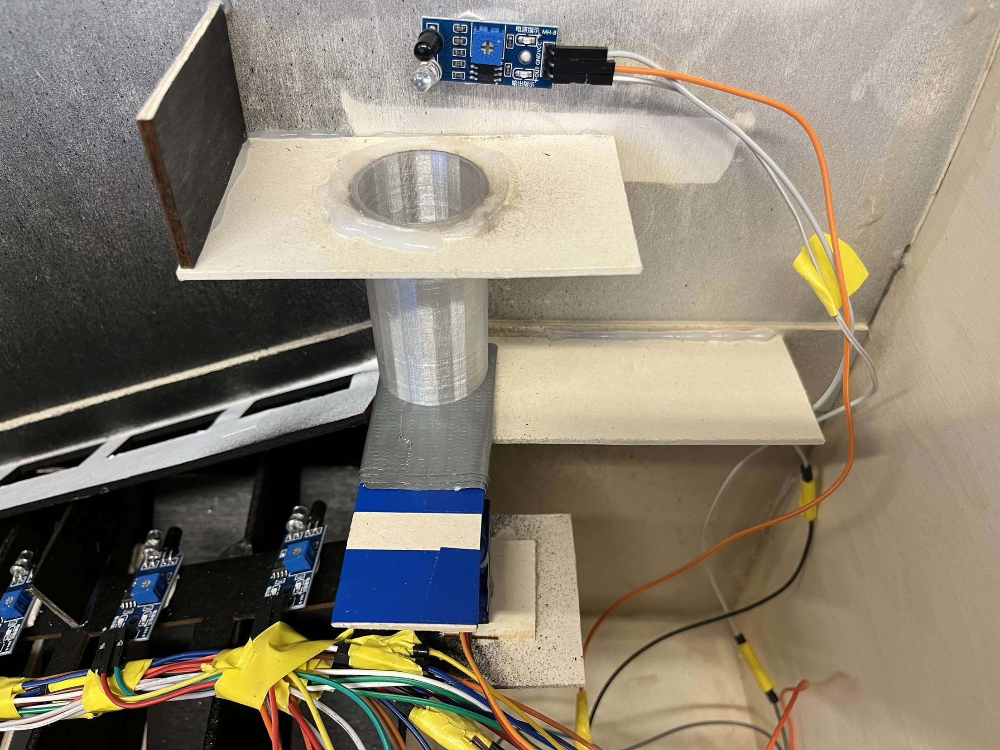
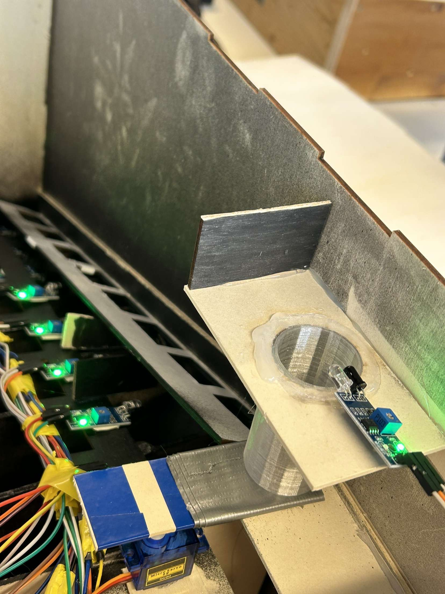
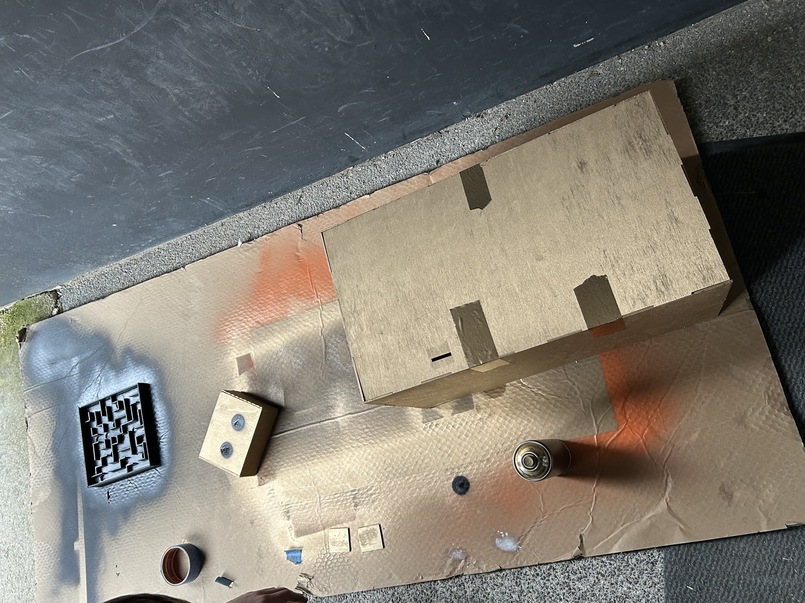
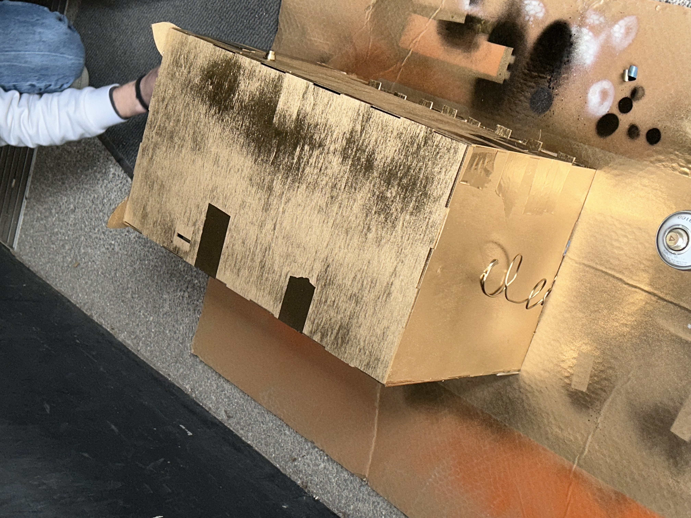
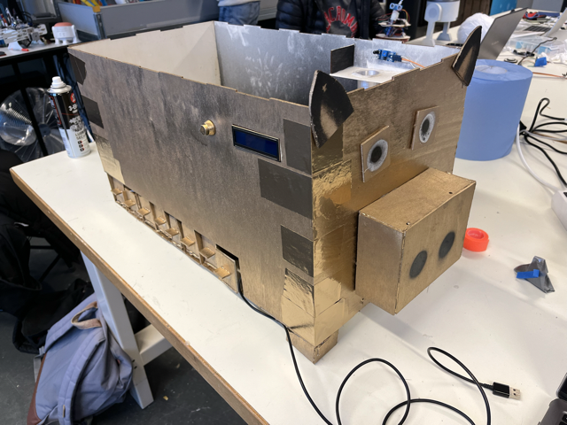
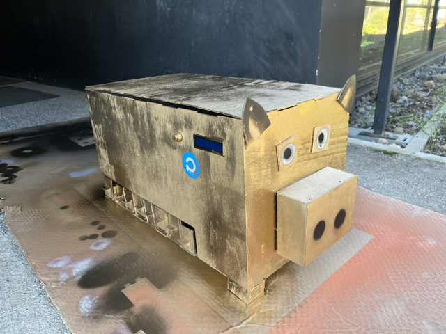

<h1>Ralph - Rapport Séance 8 - Derniere séance</h1>	

<h3> Ajout de rallonges pour certains cables </h3>

 La séance d'aujourd'hui était dédiée a la mise en place de tous les capteurs, le moteur, l'ecran et le bouton. 

 Lors des dernieres séances j'ai fabriqué tous les cables nécessaires (34 cables) mais lors du branchement final j'ai remarqué que certains cables étaient beaucoup trop court.

J'ai donc ajouté des cables femelle-male aux cables trop courts. 

Dans la photo on peut voir tous les cables (Benjamin a branché les capteurs et a fait le cable management). 
 

 ----------------------------- 

<h3> Installation + branchement du moteur </h3>

Ensuite, je me suis occupé de fixer le moteur sur la plateforme en dessous de celle des pieces. 

 J'ai remarqué que la plateforme était trop basse, donc j'ai collé un bout de bois d'epaisseur 5mm pour la lever. 
 

Ensuite, j'ai ajouté un mur noir devant le capteur du moteur. Nous avons fait cela pour tous nos capteurs pour les rendre plus efficaces.

 Les capteurs fonctionnent mieux dans le noir. J'ai donc collé ce mur noir en face du capteur:

 ----------------------------- 

<h3> Test du bon fonctionnement de notre tirelire </h3>

 Nous avons testé notre tirelire un bon nombre de fois.

 Nous avons remarqué que nos capteurs détectaient des objets inexistants de temps en temps.

 Tout est une question de réglage. Il faut augmenter ou baisser la sensitivité de nos capteurs avec un tourne-vis sur la partie bleue du capteur.

 ----------------------------- 

<h3>Dernière étape: DÉCORATION</h3>

Enfin, nous nous sommes tous les deux concentrés sur la décoration.

Vu que c'est une tirelire, nous avons décidé de transformer notre boite en cochon.

Malheureusement il n'y avait pas de peinture rose, on a peint notre boite en dorée.

 Benjamin a coupé de morceaux de boites pour faire les oreilles, le nez et les yeux

 J'ai fais la queue et les pates (des cubes en boit dans les coins):

 Nous avons finis par enlever les bouts de scotch (on les a mis à l'intérieur de la boite) et repeint les bouts manquants. Et voilà notre projet final: 

