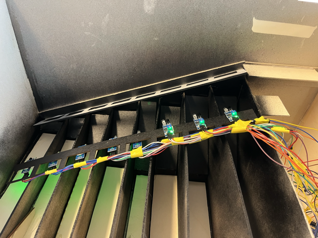

<h1>Ralph - Rapport Séance 8 - Derniere séance</h1>	

<h3> Ajout de rallonges pour certains cables </h3>

 La séance d'aujourd'hui était dédiée a la mise en place de tous les capteurs, le moteur, l'ecran et le bouton. 

 Lors des dernieres séances j'ai fabriqué tous les cables nécessaires (34 cables) mais lors du branchement final j'ai remarqué que certains cables étaient beaucoup trop court.

J'ai donc ajouté des cables femelle-male aux cables trop courts. 

Dans la photo on peut voir tous les cables (Benjamin a branché les capteurs et a fait le cable management). 
 

 ----------------------------- 

<h3> Installation + branchement du moteur </h3>

Ensuite, je me suis occupé de fixer le moteur sur la plateforme en dessous de celle des pieces. 

 J'ai remarqué que la plateforme était trop basse, donc j'ai collé un bout de bois d'epaisseur 5mm pour la lever. 
 

 ----------------------------- 

<h3> Test du bon fonctionnement de notre tirelire </h3>

 

 

 ----------------------------- 

<h3>Décoration</h3>

